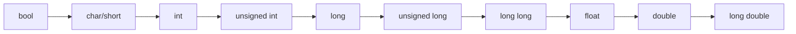

# 顺序程序设计：算法竞赛新手的第一堂课

## 什么是顺序程序设计？

想象一下，你在做一道数学题：先读题目，然后计算，最后写答案。这就是顺序程序设计的精髓——**从上到下，一步一步执行**。就像排队买奶茶一样，先来先服务，井井有条！

## C/C++语言基本概念

### C语言 vs C++：兄弟俩的故事

**C语言**就像是一个严肃的老大哥，做事直接了当，专注于解决问题。而 **C++** 则是在老大哥基础上成长起来的小弟，不仅继承了老大哥的优点，还具备了更多技能（面向对象编程）。算法竞赛中的语言知识主要是使用了C和C++中的STL

## **程序骨架：你的第一个“Hello World”**

```c
#include<stdio.h>
int main ()
{
    printf("Hello World!");
    return 0;
}
```

这是大部分C语言程序设计和算法竞赛书籍会出现的第一个C语言的程序。

解开发现他会包含一下几个部分：

1、头文件 *#include<stdio.h>*

2、主函数 *main*

3、函数语句 *printf*

4、其他...

事实上，如果是在算法竞赛中，我们会对上述几个部分进行修改，例如：

```cpp
#include<bits/stdc++.h>
using namespace std;
int main ()
{  ios_base::sync_with_stdio(false);
    cin.tie(nullptr);

    cout<<"Hello World!";
    return 0;
}
```

这里的头文件换成了竞赛的万能头，并且使用了标准命名空间，在主函数中，取消了同步流，这可以使得cin更加迅速。

## 📝 C语言格式化输入输出

### scanf函数

scanf函数称为格式输入函数，即按照格式字符串的格式，从键盘上把数据输入到指定的变量之中。[C语言scanf函数详解](https://www.runoob.com/cprogramming/c-function-scanf.html)

**基本语法格式：**

```c
int scanf(const char *format, 地址列表);
```

**重要语法要点：**

- 格式控制字符串：指定输入数据的类型和格式
  
- 地址列表：变量的地址，用`&`运算符获取
  
- 返回值：成功读取的数据项个数
  

```c
#include <stdio.h>
int main() {
    int a, b;
    float f;
    char c;

    printf("请输入两个整数：");
    scanf("%d %d", &a, &b);  // 注意&符号！

    printf("请输入一个浮点数：");
    scanf("%f", &f);

    printf("请输入一个字符：");
    scanf(" %c", &c);  // 注意%c前的空格，用来跳过前面的换行符

    printf("结果：%d + %d = %d, 浮点数=%f, 字符=%c\n", a, b, a+b, f, c);
    return 0;
}
```

### printf函数

printf函数发送格式化输出到标准输出stdout。[C语言printf函数详解](https://www.runoob.com/cprogramming/c-function-printf.html)

**基本语法格式：**

```c
int printf(const char *format, 参数列表);
```

### 完整的格式说明符表格

C语言printf格式控制符包含转换说明符、宽度控制、精度控制等多种功能：[格式控制符详解](https://blog.csdn.net/cnds123/article/details/121372599)

| 格式说明符 | 数据类型 | 说明  | 示例输出 |
| --- | --- | --- | --- |
| `%d` | int | 十进制整数 | `123` |
| `%u` | unsigned int | 无符号十进制整数 | `123` |
| `%o` | int | 八进制整数 | `173` |
| `%x` | int | 十六进制整数(小写) | `7b` |
| `%X` | int | 十六进制整数(大写) | `7B` |
| `%f` | float/double | 浮点数 | `3.141593` |
| `%e` | float/double | 科学计数法(小写e) | `3.141593e+00` |
| `%E` | float/double | 科学计数法(大写E) | `3.141593E+00` |
| `%g` | float/double | 自动选择%f或%e | `3.14159` |
| `%G` | float/double | 自动选择%f或%E | `3.14159` |
| `%c` | char | 字符  | `A` |
| `%s` | char* | 字符串 | `Hello` |
| `%p` | void* | 指针地址 | `0x7ffee2b0` |
| `%%` | -   | 输出%号本身 | `%` |

scanf 和 printf 的格式符大致上是一样的，需要注意一下几个点：

**注意**：

- **`printf`输出浮点数**：`%f`通吃`float`/`double`
  
- **`scanf`输入浮点数**：`float`→`%f`，`double`→`%lf`
  
- **`long long`**：统一用`%lld`
  
- **`%c`前加空格** → `" %c"`防回车偷袭！
  

**高级格式控制：**

```c
printf("%5d", 123);        // 输出宽度为5：  123
printf("%-5d", 123);       // 左对齐：123  
printf("%05d", 123);       // 用0填充：00123
printf("%.2f", 3.14159);   // 保留2位小数：3.14
printf("%8.2f", 3.14159);  // 宽度8，精度2： 3.14
printf("%+d", 123);        // 显示符号：+123
```

## 🎨 C++风格输入输出

### cin和cout基本用法

C++的I/O发生在流中，cin是标准输入流，cout是标准输出流：[C++基本输入输出](https://www.runoob.com/cplusplus/cpp-basic-input-output.html)

```cpp
#include <iostream>
using namespace std;

int main() {
    int a, b;
    float f;
    string name;

    cout << "请输入两个整数：";
    cin >> a >> b;  // 箭头方向表示数据流向

    cout << "请输入一个浮点数：";
    cin >> f;

    cout << "请输入你的姓名：";
    cin >> name;

    cout << "结果：" << a << " + " << b << " = " << (a+b) << endl;
    cout << "浮点数：" << f << endl;
    cout << "你好，" << name << "！" << endl;

    return 0;
}
```

### iomanip库：格式控制

iomanip头文件提供了丰富的格式操控函数：[iomanip详解](https://www.geeksforgeeks.org/iomanip-in-cpp/)

```cpp
#include <iostream>
#include <iomanip>
using namespace std;

int main() {
    double pi = 3.141592653589793;
    int num = 42;

    // 精度控制
    cout << "默认精度：" << pi << endl;
    cout << "设置精度为3：" << setprecision(3) << pi << endl;

    // 固定小数点格式
    cout << "固定小数点：" << fixed << setprecision(2) << pi << endl;

    // 科学计数法
    cout << "科学计数法：" << scientific << pi << endl;

    // 宽度和填充
    cout << "设置宽度10：" << setw(10) << num << endl;
    cout << "用*填充：" << setfill('*') << setw(10) << num << endl;

    // 进制控制
    cout << "十进制：" << dec << num << endl;
    cout << "八进制：" << oct << num << endl;
    cout << "十六进制：" << hex << num << endl;

    // 显示进制前缀
    cout << "显示前缀：" << showbase << hex << num << endl;

    return 0;
}
```

### 常用iomanip操控函数表

| 函数  | 功能  | 示例  |
| --- | --- | --- |
| `setprecision(n)` | 设置浮点数精度 | `setprecision(3)` |
| `setw(n)` | 设置字段宽度 | `setw(10)` |
| `setfill(c)` | 设置填充字符 | `setfill('0')` |
| `fixed` | 固定小数点格式 | `fixed` |
| `scientific` | 科学计数法格式 | `scientific` |
| `left` | 左对齐 | `left` |
| `right` | 右对齐 | `right` |
| `showbase` | 显示进制前缀 | `showbase` |
| `showpos` | 显示正号 | `showpos` |
| `uppercase` | 十六进制字母大写 | `uppercase` |
| `dec` | 十进制输出 | `dec` |
| `oct` | 八进制输出 | `oct` |
| `hex` | 十六进制输出 | `hex` |

## 🧮 表达式与运算符

### 基本运算符家族

```cpp
int a = 10, b = 3;
cout << "加法：" << a + b << endl;    // 13
cout << "减法：" << a - b << endl;    // 7
cout << "乘法：" << a * b << endl;    // 30
cout << "除法：" << a / b << endl;    // 3 (整数除法)
cout << "取余：" << a % b << endl;    // 1
cout << "浮点除法：" << (double)a / b << endl;  // 3.33333
```

### 自增自减：程序员的懒人神器

```cpp
int count = 5;
cout << "原始值：" << count << endl;        // 5
cout << "后缀++：" << count++ << endl;      // 5 (先使用再加)
cout << "现在值：" << count << endl;        // 6
cout << "前缀++：" << ++count << endl;      // 7 (先加再使用)
cout << "前缀--：" << --count << endl;      // 6 (先减再使用)
```

### 复合赋值运算符

```cpp
int score = 100;
score += 10;    // score = score + 10; 现在是110
score -= 5;     // score = score - 5;  现在是105
score *= 2;     // score = score * 2;  现在是210
score /= 3;     // score = score / 3;  现在是70
```

## 🧠 C/C++ 数据类型与类型转换完全指南

> **“数据类型是程序的DNA——理解它，你就能掌控代码的遗传密码！”**

下面将全面解析C/C++的数据类型系统及转换机制，涵盖**基本数据类型**、**派生类型**、**隐式/显式转换**及**实战避坑指南**。

---

### 一、C/C++ 数据类型全景图

### 1. 基本数据类型（Primitive Types）

| **类型分类** | **C/C++ 类型** | **位宽(位)** | **取值范围** | **示例** |
| --- | --- | --- | --- | --- |
| **整型** | `char` | 8   | -128~127 或 0~255 | `char c = 'A';` |
|     | `short` | 16  | -32,768~32,767 | `short s = 100;` |
|     | `int` | 32  | -2³¹~2³¹-1 (约±21亿) | `int i = -42;` |
|     | `long` | 32/64 | 平台相关 | `long L = 1000000L;` |
|     | `long long` (C++11) | 64  | -2⁶³~2⁶³-1 | `ll = 1e18;` |
| **无符号整型** | `unsigned char` | 8   | 0~255 | `uchar uc = 255;` |
|     | `unsigned int` | 32  | 0~4,294,967,295 | `uint ui = 4000000000;` |
| **浮点型** | `float` | 32  | ±3.4e-38~±3.4e38 | `float f = 3.14f;` |
|     | `double` | 64  | ±1.7e-308~±1.7e308 | `double d = 2.71828;` |
|     | `long double` | 80/128 | 扩展精度 | `ld = 1.18973e4932;` |
| **布尔型** | `bool` (C++) | 8(通常) | `true`/`false` | `bool flag = true;` |
|     | `_Bool` (C99) | 8(通常) | 0/1 | `_Bool b = 1;` |

> 💡 **关键事实**：
> 
> - `char`本质是**1字节整型**，存储ASCII值
> - `int`大小通常等于CPU字长（32位系统为4字节）
> - 浮点数遵循 **IEEE 754** 标准，存在精度损失风险

---

### 2. 派生数据类型（Derived Types）

#### 复合类型

```c
// 数组：同类型元素集合  
int arr[5] = {1, 2, 3}; // 未初始化元素自动为0  

// 结构体：异构数据聚合  
struct Point {  
    double x;  
    double y;  
};  
Point p1 = {3.5, 2.8};  

// 联合体：共享内存空间  
union Data {  
    int i;  
    float f;  
    char str[4];  
};  
Data data; // 同一时刻只能存一个成员  
```

#### 指针类型

```c
int* ptr = &i;     // 指向整型  
double* dptr = &d; // 指向双精度  
void* vptr = ptr;  // 通用指针（可指向任意类型）  
```

#### 其他类型

```cpp
// C++特有  
std::string str = "Hello"; // 字符串对象  
std::vector<int> vec;     // 动态数组  
std::unique_ptr<int> smart_ptr; // 智能指针  
```

---

## 二、类型转换机制剖析

### 1. 隐式转换（编译器自动完成）

#### 算术转换规则（由低到高）



**典型场景**：

```c
int i = 10;  
double d = i;     // int → double (安全)  

float f = 3.14f;  
double d2 = f;    // float → double (安全)  

int j = 2.718;    // double → int (截断小数)→ j=2  
```

#### 整型提升（Integer Promotion）

```c
char c1 = 100, c2 = 100;  
int result = c1 * c2; // char自动提升为int计算  
// 若用char接收：char r = c1*c2; → 溢出错误！  
```

#### 符号处理规则

```c
unsigned int u = 10;  
int s = -5;  

if (s < u) // 陷阱！s被转为unsigned → 结果false！  
```

> ⚠️ **隐式转换三大陷阱**：
> 
> 1. 浮点→整型：**截断小数**（非四舍五入）
> 2. 大类型→小类型：**数据截断**
> 3. 有符号↔无符号：**符号位误解**

---

### 2. 显式转换（程序员手动控制）

#### C风格强制转换

```c
double pi = 3.14159;  
int approx = (int)pi;          // 截断 → approx=3  
float fpi = (float)pi;         // 精度损失  

char* p = (char*)&approx;      // 整型指针→字符指针  
```

#### C++风格安全转换

| **转换类型** | **语法** | **适用场景** |
| --- | --- | --- |
| `static_cast` | `static_cast<T>(expr)` | 基本类型转换、父子类指针转换 |
| `dynamic_cast` | `dynamic_cast<T>(expr)` | 多态类安全向下转型 |
| `const_cast` | `const_cast<T>(expr)` | 移除`const`属性 |
| `reinterpret_cast` | `reinterpret_cast<T>(expr)` | 低层指针转换（高风险！） |

```cpp
// 安全浮点→整型  
double d = 7.8;  
int i = static_cast<int>(d); // i=7  

// 移除const属性  
const char* str = "hello";  
char* modifiable = const_cast<char*>(str);  

// 危险的内存重新解释  
int x = 0x12345678;  
char* bytes = reinterpret_cast<char*>(&x);  
// bytes[0]=0x78 (小端系统)  
```

---

## 三、类型转换实战场景

### 1. 数值计算中的转换

```c
int a = 5, b = 2;  
double result = a / b;      // ❌ 整数除法 → 2.0  
double correct = static_cast<double>(a) / b; // ✅ 5.0/2 → 2.5  
```

### 2. 指针类型转换

```cpp
Base* base = new Derived();  
// 安全向下转型  
Derived* derived = dynamic_cast<Derived*>(base);  
if (derived) { /* 成功转换 */ }  

// 危险的内存重解释  
void* raw = reinterpret_cast<void*>(0xDEADBEEF);  
```

### 3. 自定义类型转换（C++）

```cpp
class Meter {  
public:  
    explicit Meter(double val) : value(val) {}  
    operator double() const { return value; } // 转换函数  
private:  
    double value;  
};  

Meter m(100);  
double dist = m; // 自动调用operator double()  
```

---

## 四、常见类型转换陷阱与解决方案

1. **浮点精度损失**
  
  ```c
  double d = 0.1 + 0.2; // 0.30000000000000004  
  // 解决方案：使用容忍度比较  
  const double eps = 1e-9;  
  if (fabs(d - 0.3) < eps) { /* 视为相等 */ }  
  ```
  
2. **整数溢出**
  
  ```c
  int a = 1000000;  
  int b = a * a; // 溢出 → 错误结果！  
  // 解决方案：使用更大类型  
  long long big = (long long)a * a;  
  ```
  
3. **符号位扩展问题**
  
  ```c
  char c = 0xFF; // -1 (有符号)  
  int i = c;      // -1 (符号扩展)  
  unsigned char uc = 0xFF; // 255  
  int ui = uc;     // 255 (零扩展)  
  ```
  
4. **指针类型误用**
  
  ```c
  int* p = malloc(sizeof(int)*10); // ❌ C++需类型转换  
  // 正确：  
  int* p = static_cast<int*>(malloc(sizeof(int)*10));  
  ```
  
5. **C++窄化转换警告**
  
  ```cpp
  int i = 3.14; // 触发编译器警告  
  // 明确表示接受窄化：  
  int j = static_cast<int>(3.14);  
  ```
  

---

> **终极心法**：
> 
> 1. **最小惊讶原则**：避免隐式转换，优先使用显式`static_cast`
> 2. **防御性编程**：对转换结果进行有效性验证
> 3. **类型安全至上**：C++中避免C风格强制转换
> 4. **精度敏感场景**：使用整型代替浮点数（如货币计算）

**记住：类型系统是你的盟友而非敌人——理解它，驯服它，你的代码将无往不利！** 💪

## 🚀 算法竞赛输入数据情形与处理方法大全

> **“输入处理是算法竞赛的起跑线——快人一步，AC不愁！”**

本文全面总结算法竞赛（洛谷/牛客/力扣/Codeforces）中**8大类输入情形**及对应的**高效处理方法**，附C++代码模板和避坑指南。

---

## 一、基础输入情形（90%题目适用）

### 1. 单变量输入

**情形**：输入单个整数/浮点数/字符串  
**题例**：计算平方（牛客NC22001）

```cpp
int n;  
cin >> n;  
// 或 scanf("%d", &n);  
```

### 2. 多变量同行输入

**情形**：用空格分隔的多个数据  
**题例**：A+B Problem（洛谷P1001）

```cpp
int a, b;  
cin >> a >> b;                // C++  
scanf("%d %d", &a, &b);       // C语言  
```

### 3. 多行输入（固定行数）

**情形**：第一行为数据量n，后面n行数据  
**题例**：学生成绩统计（力扣模拟题）

```cpp
int n;  
cin >> n;  
vector<int> arr(n);  
for(int i=0; i<n; i++)  
    cin >> arr[i];  
```

---

## 二、进阶输入情形（含特殊格式）

### 4. 不定长空格分隔输入

**情形**：单行未知数量的数据（如数组输入）  
**题例**：数组排序（洛谷P1177）

```cpp
vector<int> nums;  
int x;  
while(cin >> x) {  
    nums.push_back(x);  
    if(cin.get() == '\n') break; // 检测换行  
}  
```

### 5. 含逗号分隔的输入

**情形**：CSV格式数据（常见于力扣）  
**题例**：字符串分割（力扣LCR 122）

```cpp
string s;  
cin >> s;  
stringstream ss(s);  
vector<string> tokens;  
while(getline(ss, token, ',')) { // 按逗号分割  
    tokens.push_back(token);  
}  
```

### 6. 混合类型输入

**情形**：一行中含多种数据类型  
**题例**：商品信息处理（牛客NC20154）

```cpp
string name;  
double price;  
int stock;  

// 输入示例: "Apple 5.99 100"  
cin >> name >> price >> stock;  
```

---

## 三、复杂输入情形（需特殊处理）

### 7. 多组测试数据（高频考点！）

#### 情形1：未知组数（EOF结束）

**题例**：A+B系列（Codeforces 1A）

```cpp
int a, b;  
while(cin >> a >> b) {    // 自动检测EOF  
    cout << a + b << endl;  
}  
/* C语言版 */  
while(scanf("%d %d", &a, &b) != EOF) {  
    printf("%d\n", a+b);  
}  
```

#### 情形2：指定组数

**题例**：矩阵运算（洛谷P1303）

```cpp
int T;  
cin >> T;  
while(T--) {  
    // 处理每组数据  
}  
```

#### 情形3：特殊结束符（如0）

**题例**：循环求和（牛客NC22003）

```cpp
int x;  
while(cin >> x && x != 0) {  
    // 遇到0停止  
}  
```

### 8. 字符串处理（易错重灾区！）

#### 情形1：含空格字符串

**题例**：句子反转（力扣LCR 181）

```cpp
string s;  
getline(cin, s);  // 读取整行  

// 注意：混合cin和getline时清空缓冲区  
cin.ignore(); // 在getline前使用  
```

#### 情形2：特定格式字符串

**题例**：时间解析（Codeforces 4A）  
输入格式：`[HH:MM]`

```cpp
char colon;  
int hour, minute;  
cin >> hour >> colon >> minute;  
```

#### 情形3：大文本输入（>1MB）

**优化方案**：

```cpp
ios::sync_with_stdio(false);  // 关闭同步  
cin.tie(0);                   // 解绑cin/cout  
string s;  
s.reserve(1000000);           // 预分配内存  
cin >> s;                     // 或getline  
```

---

## 四、输入优化技巧（大数据必备）

### 1. 快速读入（整数）

**适用场景**：数据量 > 10^6

```cpp
inline int read() {  
    int x=0, f=1;  
    char c=getchar();  
    while(c<'0' || c>'9') {  
        if(c=='-') f=-1;  
        c=getchar();  
    }  
    while(c>='0' && c<='9') {  
        x = x*10 + c-'0';  
        c=getchar();  
    }  
    return x*f;  
}  

// 使用  
int n = read();  
```

### 2. 按行快速输入

```cpp
const int BUF = 1<<20;  
char buf[BUF], *p1=buf, *p2=buf;  
char gc() {  
    return p1==p2 && (p2=(p1=buf)+fread(buf,1,BUF,stdin), p1==p2) ? EOF : *p1++;  
}  
```

### 3. C++流加速（通用）

```cpp
#include <iostream>  
int main() {  
    std::ios::sync_with_stdio(false);  
    std::cin.tie(nullptr);  
    // 后续输入操作...  
}  
```

---

## 五、平台差异处理指南

| **平台** | **输入特点** | **应对策略** |
| --- | --- | --- |
| **洛谷** | 严格遵循题面格式 | 仔细阅读输入描述 |
| **牛客网** | 多含多组测试数据 | 务必写EOF循环 |
| **力扣** | 参数通过函数传入 | 无需处理输入，专注函数实现 |
| **Codeforces** | 输入量大且格式多变 | 使用快速读入+鲁棒性处理 |

---

## 六、输入处理自测题（检验掌握程度）

1. **情形**：第一行整数n，第二行n个空格分隔整数
  
  ```cpp
  int n; cin >> n;  
  vector<int> arr(n);  
  for(int i=0; i<n; i++) cin >> arr[i];  
  ```
  
2. **情形**：未知行数，每行两个整数直到EOF
  
  ```cpp
  int a, b;  
  while(cin >> a >> b) {  
      /* 处理 */  
  }  
  ```
  
3. **情形**：含空格的字符串和后续数字
  
  ```
  输入： "Hello World 2023"  
  ```
  
  ```cpp
  string s1, s2;  
  int year;  
  cin >> s1 >> s2 >> year;  
  ```
  
4. **情形**：逗号分隔的浮点数
  
  ```
  输入： "3.14,2.718,1.618"  
  ```
  
  ```cpp
  string line;  
  getline(cin, line);  
  stringstream ss(line);  
  vector<double> nums;  
  string token;  
  while(getline(ss, token, ',')) {  
      nums.push_back(stod(token));  
  }  
  ```
  

> **竞赛输入心法**：
> 
> 1. **先看数据范围** → 决定是否用快速读入
> 2. **次看数据格式** → 确定分割方式
> 3. **三验边界条件** → 空行/空格/极端值
> 4. **最后平台适配** → 特别是EOF处理

---

掌握这些输入技巧，你将轻松突破算法竞赛的**第一道防线**！下次遇到输入问题，回来看看这张速查表吧~ 🚀

## 📚 推荐学习资源

根据搜索到的优质资料，推荐以下学习资源：

1. **在线教程**：
  
  - [菜鸟教程C语言](https://www.runoob.com/cprogramming/c-tutorial.html)
    
  - [C语言中文网](https://c.biancheng.net/)
    
2. **练习平台**：
  
  - 洛谷
    
  - Codeforces
    
  - AtCoder
    
3. **经典书籍**：
  
  - 《C程序设计语言》(K&R)
    
  - 《C++ Primer》
    
  - 《算法竞赛入门经典》
    

## 🎉 总结：你的编程之旅开始了！

顺序程序设计是所有编程技能的基石。通过本文，你应该掌握了：

1. **输入输出基础**：scanf/printf的详细用法和格式控制
  
2. **现代C++方式**：cin/cout和iomanip库的强大功能
  
3. **数据类型系统**：各种进制的表示和转换方法
  
4. **实践技巧**：竞赛中常用的优化和陷阱规避
  

记住这几个要点：

- **多练习**：熟能生巧，代码写多了自然就顺手了
  
- **多思考**：每道题都有多种解法，思考哪种更优雅
  
- **注重细节**：格式控制、进制转换都是细节决定成败
  
- **保持耐心**：编程就像武功，需要一点一点积累
  

现在，拿起键盘，开始你的算法竞赛之旅吧！加油！🚀

---
